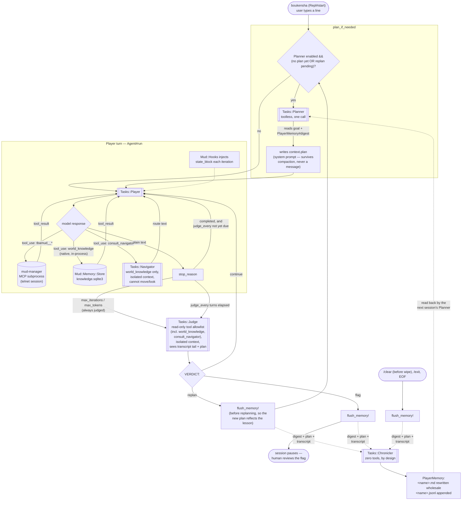

# Claude Code Camp — Boukensha

This is the repo built in the Claude Code Camp operated by
[ExamPro](https://www.exampro.co): an LLM agent that plays a real MUD
(TBAMud/CircleMUD, over telnet) autonomously, session after session, built
up one weekly phase at a time.

## Why this exists

By the end of Week 2 the agent could **play** — telnet primitives, MCP tool
calls, a room graph it built as it walked, OpenTelemetry traces of the whole
thing. What it couldn't do was say what it was trying to achieve, notice
when a turn was going in circles, ask about anywhere but the room it stood
in, or remember any of it once the process exited.

Week 3 (`week3_capable/`) closes that gap with four narrow additions rather
than a rewrite: a **Planner** that writes a goal down where nothing can
evict it, a **Judge** that checkpoints and can actually disagree, a
**Navigator** for destinations the room graph can't resolve by name, and a
**Chronicler** that turns a session into memory the *next* session's Planner
reads back. All four are permission-gated to exactly what their job needs —
the Judge can't move the character, the Navigator can't even look — and all
four ship off by default, so a `settings.yaml` written before Week 3 still
runs byte-for-byte as it did.

## Repo layout

| Path | What's there |
|---|---|
| [`week0_explore/`](week0_explore/CHALLENGES.md) | MUD primitives and telnet session mechanics — `mud_manager`, the gem every later week builds on |
| [`week1_baseline/`](week1_baseline) | The first agent loop, one lesson step at a time (`ruby/00_config` … `12_context`), Ruby and Python tracks |
| [`week2_observability/README.md`](week2_observability/README.md) | MCP tools, room-graph memory, `Permissions` (built but unused), OpenTelemetry tracing, the `mud_monitor` dashboard |
| [`week3_capable/README.md`](week3_capable/README.md) | **Current state** — Planner / Judge / Navigator / Chronicler, phase-by-phase, with test counts and live-run notes |
| [`docs/plans/capability/`](docs/plans/capability) (`capability_plan` rollup + `week3_phase_{g,h,i,j}_*.md`) | Full design docs for each Week 3 phase |
| [`docs/journal/3_capable.md`](docs/journal/3_capable.md) | The narrative journal this page's numbers are pulled from — hypotheses, what surprised, what still hasn't fired |

This page is the front door; it doesn't repeat what those links already say
well.

## Architecture — the current agent loop (`week3_capable`)



**No separate `log_viz --mcp` process.** Unlike some reference designs, the
room-graph read side (`world_knowledge`, `kind=overview|room|route`) is a
*native* in-process tool — the loader hands subagents the same `Store`
instance `Mud::Hooks` already writes through, so there's no second handle
and no subprocess handshake. `mud_monitor` (a plain Sinatra dashboard) reads
`.boukensha/`'s log files and `knowledge.sqlite3` directly instead of going
through MCP.

**Two truths, kept apart.** `knowledge.sqlite3` answers "what is there?" —
spatial, current, exact. `PlayerMemory`'s digest answers "what have I
learned?" — narrative, historical, and reaches the Player *only* through the
Planner's next plan, never through its own prompt or tools.

## Verified live

Two sessions against real CircleMUD (`localhost:4000`, `claude-haiku-4-5`,
character `dummy`) — the full numbers are in
[`docs/journal/3_capable.md` §8](docs/journal/3_capable.md):

- Session 2's second turn tripped `max_iterations`. The Judge is invoked
  regardless of its schedule when a limit trips, and returned `replan` —
  every `VERDICT:` line parsed, no spurious `flag` from the fail-closed
  default.
- The Judge called `world_knowledge` unprompted, twice: `overview`, then
  `room` on the room the plan concerned.
- Session 1's memory digest was read back by session 2's Planner and
  **merged, not appended**, across the rewrite — 1039 → 1324 characters,
  `Strategies` went from empty to real content.
- **Cost: $0.09999 combined** — player $0.078 / judge $0.013 / chronicler
  $0.007 / planner $0.003. Orchestration was ~22% of spend for plan
  persistence, one course correction, and durable memory.
- Honest miss: the Navigator was registered and permission-gated for both
  sessions but called **zero** times — every destination was already an
  adjacent room the state block named. Built, gated, unproven.

> *"A checkpoint is only worth its cost if it can disagree."* Had the Judge
> only ever said `continue`, roughly 13% of spend would have bought nothing
> — instead it replanned on its first real opportunity.
> — [`docs/journal/3_capable.md`](docs/journal/3_capable.md), Key Takeaway

## Setup

Everything below lives under `week3_capable/` unless noted; `week2_observability/README.md`
documents the fork this was built from if you want the full provenance.

### 1. Build & install the gems, in dependency order

`boukensha` spawns `mud-manager` as an MCP subprocess by bare command name,
so both need to resolve on `PATH`:

```sh
cd week0_explore/mud_manager        # or week3_capable/mud_manager
gem build mud_manager.gemspec
gem install ./mud_manager-*.gem

cd ../../week3_capable/boukensha
gem build boukensha.gemspec
gem install ./boukensha-*.gem
```

`week3_capable/bin/rebuild` does both steps for you, in this order, with
`--ignore-dependencies` for the TUI gem.

### 2. `.boukensha/settings.yaml` (repo root, shared across weeks)

MCP servers are the *only* source of the agent's tools — `mud` spawns the
`mud-manager` daemon over stdio, prefixing its tools `tbamud__*` so they
never collide with anything else registered. Character identity and
credentials travel via `env:`, never via tool arguments, so the LLM never
sees or sets them:

```yaml
tasks:
  player:
    provider: anthropic
    model:    claude-haiku-4-5
    prompt_override:
      system: true

mcp_servers:
  mud:
    command: mud-manager
    args:    [--mcp]
    prefix:  tbamud
    env:
      MUD_HOST:     localhost
      MUD_PORT:     "4000"
      MUD_NAME:     dummy
      MUD_PASSWORD: helloworld
```

### 3. `.boukensha/.env` (repo root, git-ignored)

Loaded via Dotenv on startup — API keys for whichever backend `tasks.*.provider`
picks, plus two Week 2 log-directory settings:

```sh
ANTHROPIC_API_KEY=sk-ant-...
OPENAI_API_KEY=sk-...
GEMINI_API_KEY=...
OLLAMA_API_KEY=...

MUD_JOURNAL_DIR=.boukensha/journal        # Phase E change capture
BOUKENSHA_ERROR_LOG=.boukensha/error.log  # Phase F swallowed-exception capture
```

### 4. Run

```sh
boukensha              # TUI REPL
boukensha --no-tui     # plain-terminal REPL
```

There's no `--player NAME` flag — the character is whichever `MUD_NAME` is
set in `mcp_servers.mud.env` above (or `memory.character`, if you want the
memory digest keyed differently than the login name).

### 5. Optional: the dashboard

```sh
cd week3_capable/mud_monitor
bundle install
bundle exec ruby bin/mud_monitor   # http://localhost:4568
```

Reads `.boukensha/`'s session/manager/telnet/journal logs and
`knowledge.sqlite3` directly — no MCP round trip. Sessions render
colour-coded by role (green Planner / amber Judge / blue Player, red on a
`flag`).

### 6. Optional: OpenTelemetry tracing

```sh
cd week3_capable/observability
docker compose --profile jaeger up   # or: tempo, compare
```

Then flip `observability.otel.enabled: true` in `settings.yaml` (already on
in this repo's checked-in config) — `Config#apply_otel_environment!` injects
the `OTEL_*` env vars from that block.

### 7. Optional: turn on Planner / Judge / Navigator / Memory

Off by default. Each block below is independent — add only what you want:

```yaml
tasks:
  planner:
    provider: anthropic
    model:    claude-haiku-4-5
    enabled:  true
  judge:
    provider: anthropic
    model:    claude-haiku-4-5
    enabled:  true
    every:    3        # judge every 3rd turn; a tripped limit is always judged
  navigator:
    provider: anthropic
    model:    claude-haiku-4-5
    enabled:  true      # also needs a knowledge store (mud server + sqlite3 gem)

memory:
  enabled: true
  # character: Gandalf   # defaults to mcp_servers.mud.env.MUD_NAME
```

See [`week3_capable/README.md`](week3_capable/README.md) for what each flag
actually changes at runtime — REPL output, `/plan`, verdict handling.

### 8. Tests

```sh
cd week3_capable/boukensha    && bundle exec rake test
cd week3_capable/mud_manager  && bundle exec rake test
cd week3_capable/mud_monitor  && bundle exec rake test
```

As of Phase J: `boukensha` 263 runs / 746 assertions, `mud_manager` 41 / 217,
`mud_monitor` 73 / 259 — all green.

## Status

Phases G–J are built, tested, and verified live against a real CircleMUD
server (above). Two short sessions show the machinery works, not that it
plays *better* — whether an orchestrated agent beats Week 2's single agent
is still unmeasured, and the fully autonomous `Boukensha::Session.play` loop
from the original spec was never built; a human-in-the-loop REPL shipped
instead. See [`week3_capable/README.md`](week3_capable/README.md) for the
phase-by-phase detail this page intentionally leaves out.
