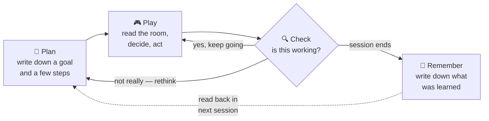

# Boukensha — an AI that learns to play a text adventure game

This is the repo built for the Claude Code Camp operated by
[ExamPro](https://www.exampro.co).

## What is this project?

A MUD ("Multi-User Dungeon") is an old-school, text-only online game: you
type commands like `look`, `north`, or `attack goblin`, and the game replies
in prose describing what happened. This project builds an AI agent —
**Boukensha** — that plays one of these games entirely on its own: reading
what the game says, deciding what to do, and typing its own commands back.
No human at the keyboard.

It's a multi-week coding camp project, and the agent was built up in
stages, one capability at a time — starting from "can it even hold a
conversation with the game" and ending with an agent that sets itself a
goal, checks whether it's actually making progress, and remembers what it
learned the next time it logs in. It's been run against a real, live game
server throughout, not just tested in theory.

## The journey, week by week

| Week | What was added |
|---|---|
| **Week 0 — Explore** | Learned to talk to the game at all: opening a raw text connection and sending/receiving commands. |
| **Week 1 — Baseline** | The first working agent: read the game's text, decide on an action, send it — one exchange at a time. |
| **Week 2 — Observability** | Gave the agent a memory of the game *world* (a map of rooms it has visited) and built a dashboard + tracing so a human can watch exactly what it saw and why it acted. |
| **Week 3 — Capable** *(current)* | Gave the agent four new abilities: to **plan** ahead, **check** its own progress, **find its way** around, and **remember** lessons across separate play sessions. |

## How the current agent thinks

At its core, one loop repeats every time the agent plays:



- **Plan** — before playing, the agent writes itself a short goal and a few
  concrete steps.
- **Play** — it reads the room, decides what to type, and sends it — over
  and over, like a person playing the game turn by turn.
- **Check** — periodically, a second "reviewer" role looks at what just
  happened and decides: keep going, rethink the plan, or stop and flag a
  human.
- **Remember** — once a play session ends, the agent writes itself a short
  note about what it learned, so it isn't starting from scratch next time.

Each of those four roles is deliberately limited to only what its job needs
— the reviewer can't move the character, for instance — which is what makes
each one trustworthy rather than just another thing that could go wrong.

*(For readers who want the code-level names: these four roles are called
the Planner, Player, Judge, and Chronicler — see
[`week3_capable/README.md`](week3_capable/README.md) for the full technical
write-up.)*

## Want to go deeper?

| Path | What's there |
|---|---|
| [`week0_explore/`](week0_explore/CHALLENGES.md) | The very first step — talking to the game over a raw connection |
| [`week1_baseline/`](week1_baseline) | The first working agent, built one lesson at a time |
| [`week2_observability/README.md`](week2_observability/README.md) | The world map, the dashboard, and tracing |
| [`week3_capable/README.md`](week3_capable/README.md) | The full technical write-up of the Plan/Play/Check/Remember loop |
| [`docs/plans/capability/`](docs/plans/capability) | Design docs written before Week 3 was built |
| [`docs/journal/3_capable.md`](docs/journal/3_capable.md) | The engineering journal — what was tried, what surprised, what's still unproven |

## Setup

This section is technical — it's for anyone who wants to actually run the
agent, not required reading otherwise.

### 1. Build & install the gems, in dependency order

`boukensha` spawns `mud-manager` as a subprocess by bare command name, so
both need to resolve on `PATH`:

```sh
cd week0_explore/mud_manager        # or week3_capable/mud_manager
gem build mud_manager.gemspec
gem install ./mud_manager-*.gem

cd ../../week3_capable/boukensha
gem build boukensha.gemspec
gem install ./boukensha-*.gem
```

`week3_capable/bin/rebuild` does both steps for you, in this order.

### 2. `.boukensha/settings.yaml` (repo root, shared across weeks)

```yaml
tasks:
  player:
    provider: anthropic
    model:    claude-haiku-4-5
    prompt_override:
      system: true

mcp_servers:
  mud:
    command: mud-manager
    args:    [--mcp]
    prefix:  tbamud
    env:
      MUD_HOST:     localhost
      MUD_PORT:     "4000"
      MUD_NAME:     dummy
      MUD_PASSWORD: helloworld
```

Credentials travel via `env:` here, never through the model's own tool
calls, so the agent itself never sees or sets them.

### 3. `.boukensha/.env` (repo root, git-ignored)

```sh
ANTHROPIC_API_KEY=sk-ant-...
OPENAI_API_KEY=sk-...
GEMINI_API_KEY=...
OLLAMA_API_KEY=...
```

### 4. Run

```sh
boukensha              # TUI REPL
boukensha --no-tui     # plain-terminal REPL
```

The character played is whichever `MUD_NAME` is set in
`mcp_servers.mud.env` above.

### 5. Optional: the dashboard

```sh
cd week3_capable/mud_monitor
bundle install
bundle exec ruby bin/mud_monitor   # http://localhost:4568
```

### 6. Optional: turn on Plan / Check / Remember

Off by default, so existing configs keep working unchanged:

```yaml
tasks:
  planner:
    provider: anthropic
    model:    claude-haiku-4-5
    enabled:  true
  judge:
    provider: anthropic
    model:    claude-haiku-4-5
    enabled:  true
    every:    3        # check in every 3rd turn

memory:
  enabled: true
```

See [`week3_capable/README.md`](week3_capable/README.md) for the full set of
options, including the Navigator.

### 7. Tests

```sh
cd week3_capable/boukensha    && bundle exec rake test
cd week3_capable/mud_manager  && bundle exec rake test
cd week3_capable/mud_monitor  && bundle exec rake test
```
